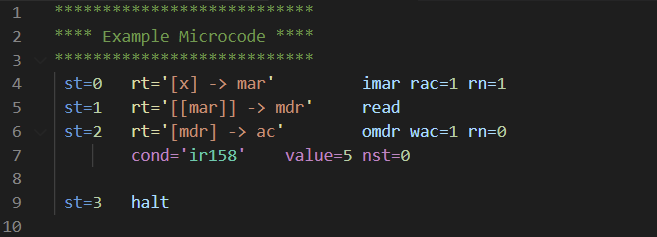

# OSIAC Microcode Syntax Highlighting README

## About

Adds syntax highlighting support for OSIAC Microcode. The OSIAC is a simplified RISC computer architecture designed for The Ohio State University's ECE 5362 Computer Architecture and Design Class.

## Features

* Highlights all elements of OSIAC microcode syntax
* Reports invalid instructions or control lines

## Release Notes

### 1.0.0

Initial release of extension
